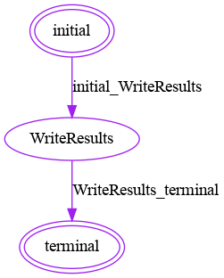

# [FeatureCloud Image Loader App](https://featurecloud.ai/app/image-loader)

## Description
Using the Image Loader app, users can load their images from different directories and perform some local preprocessing 
steps without communicating with the coordinator.

## Input
- path to the directory containing the images  
- image formats to be searched for in the directory
- label_file: labels of images, either in a file inside the directory or the name of the directory that includes images.
  The label file could be in .csv or .txt extension; in both cases, the first line should be 'name,label', and a comma should be used as a separator.
 
## Output
- dataset.npy: including [image sample, labels]

## Preprocessing

- Resize: resizing images to  a specific 'width' and 'height'.
- Crop: cropping images based on a specific x and y coordinates, with a particular width and height

## Workflows
Image loader needs no communication with the coordinator during its run and can be optionally used at the beginning 
of a workflow with apps that require images in NumPy files 
- Post: Various Preprocessing or Analysis apps that support `.npy` format for their input files
  (e.g., Image normalization, Cross-Validation, and/or Deep Learning)

## Config
Following config information should be included in the `config.yml` to run the Image Loader app in a workflow:
```
fc_image_loader:
  local_dataset:
    ds_dir: ds
    image_format: jpeg
    target_value: dir
    sep: ','
  image_resize:
    width: 28
    height: 28
  image_crop:
    x_coordinate: 0
    y_coordinate: 0
    width: 28
    height: 28
  result:
    data: dataset.npy
```
Options for `local_dataset` are very similar to the
[cross-validation](https://github.com/FeatureCloud/fc-cross-validation/tree/Numpy#input) and
[data distributor](https://github.com/FeatureCloud/fc-data-distributor#config) apps.

### Run image loader
#### Prerequisite
To run the image loader application, you should install Docker and featurecloud pip package:
```shell 
pip install featurecloud
```
Then either download the image loader image from featurecloud docker repository:
```shell
featurecloud app download featurecloud.ai/fc_image_loader 
```
Or build the app locally:
```shell
featurecloud app build featurecloud.ai/fc_image_loader
```
You can use provided example data or your own data. And provide the desired settings in the `config.yml` file.
#### Running app
You can run image loader as a standalone app in the [FeatureCloud test-bed](https://featurecloud.ai/development/test) or [FeatureCloud Workflow](https://featurecloud.ai/projects). You can also run the app using CLI:
```shell
featurecloud test start --app-image featurecloud.ai/fc_image_loader --client-dirs './sample/0,./sample/1' --generic-dir './sample/generic'
```
